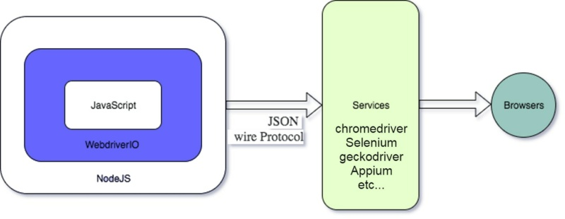
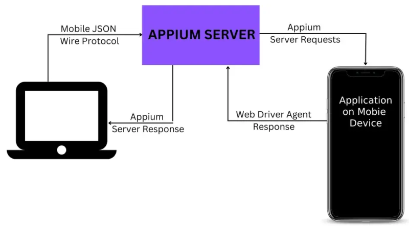

# 1 Що таке WDIO
WDIO (WebdriverIO) based on WebDriver protocol.
WDIO the only JS framework that supports integration with Appium for mobile testing.

Usage:
- Web testing
- Mobile testing (Android/iOS)
- API testing
- Visual testing



## Client-side
- Using JS library you could write tests
- Interaction with browser or mobile device: client side uses JSON wire protocol to send commands to browser or mobile emulator.
- WDIO uses asynchronous approach

## Server-side
- WebDriver server - separate processthat controls browser or emulator. It receives commands from client side and executes them and returns results.
- Browsers and emulators
- WebDriver protocol (JSON wire protocol)

WDIO Introduction
https://webdriver.io/docs/api/


# 2 Що таке Appium?
Appium:
- cross-platform (Android/iOS)
- multilanguage (Java, Python, Ruby, JS)
- Visual inspector

Possibilities:
- Automation of native, hybrid and mobile applications
- Automating gestures (swipe, zoom, scroll, etc)
- Automating on real devices and emulators

Client library <-> Mobile JSON Wire Protocol <-> Appium Server <-> Mobile Device

## Appium architecture
Drivers (XCUITest for iOS, UIAutomator for Android)



Appium Documentation
https://appium.io/docs/en/latest/


# 3 VS Code + Node JS setup (Windows)
## VS Code
Install VS Code  
Set theme:
```
Preferences→Settings→User→Workbench→Appearance→Color Customizations
```

Popular extensions:
- ESLint: linter for JavaScript
- Prettier: formatter
- Live Server: starts local server for viewing Web-pages
- GitLens: extends possibilities Git in VS Code
- Material Icon Theme: changes icons in VS Code to material design
- Bracket Pair Colorizer: highlights pairs of brackets with different colors for better navigation in code

## Node.js
Install Node.js - environment for running JS code  
To check Node.js installation run:
```
node -v
npm -v
```

NPM commands:
```
npm install <PACKAGE>  // install packgae
npm uninstall <PACKAGE>  // removes package
npm init  // initialize project and creates package.json
npm install -g <PACKAGE>  // install package globally
npm install <PACKAGE>@<VERSION>  // install specific package version
```

### Additional options
-save: adds package to dependency list in package.json
-save-dev: adds package to dependency list for development
-save-optional: adds package to dependency list as non-obligatory dependency

VS Code
https://code.visualstudio.com/

Visual Studio Code Extensions to Boost Your Productivity in 2024
https://www.freecodecamp.org/news/best-vscode-extensions/

Node.js
https://nodejs.org/en


# 4 Java + Android setup (Windows)
## Java
To check if Java is installed
```
java --version
```

Install Java  
Set JAVA_HOME envvar to path to installed JDK  
To Path envvar add path <JDK>/bin  

## Android
Download Android Studio
Set ANDROID_HOME envvar to path `Users/<USER>/AppData/Local/Android/Sdk`
To Path envar add paths:
- `Users/<USER>/AppData/Local/Android/Sdk/tools`
- `Users/<USER>/AppData/Local/Android/Sdk/platform-tools`

Download Java
https://www.oracle.com/il-en/java/technologies/downloads/

Download Android Studio
https://developer.android.com/


# 5 Emulator+Appium+Appium Inspector Setup (Windows)
To start new Android emulator:
Android Studio -> More Actions -> Virtual Device Manager
Create Virtual Device
Select device
Select OS image

Install Appium
```
npm install -g appium
```

To start Appium run
```
appium
```

If you see error, run the following command:
```
Set-ExecutionPolicy Bypass -Scope Policy
```

Install drivers (list of drivers):
```
appium driver install <DRIVER_NAME>
```

For these course install:
```
appium driver install xcuitest
appium driver install uiautomator2
```

Install Appium inspector (from GitHub repository)
https://github.com/appium/appium-inspector/releases

To start device click Run button.

In Appium Server fill in Device Capabilities (Device Manager -> View Details):
- platformName (Android / iOS)
- deviceName
- platformVersion
- automationName (uiautomator2 / xcuitest)

Capabilities could be saved for future (Save As...)

Install Appium
https://appium.io/docs/en/2.0/quickstart/install/


# 6 VS Code + Node.js setup (Mac)
Install VS Code  
Add Code Spell Checker extension  

Install Node.js
```
brew install node@24
node -v
npm -v
```


# 7 Appium+Appium Inspector + Xcode + Simulator setup (Mac)
Install XCode (navigate from Google to appstore).  
Install with all default options and simulators.  
XCode -> Open Developer Tool -> Simulator  

Install Appium
Install Appium Server
```
npm i -g appium
```
Install Appium drivers
```
appium driver install xcuitest
appium driver install uiautomator2
```

Install Appium Inspector
https://github.com/appium/appium-inspector/releases
Download and install
On Appium Inspector you got "Apple could not verify “Appium Inspector” is free of malware that may harm your Mac or compromise your privacy." error.
To fix it:
- Open System Settings: Click the Apple menu icon and select System Settings
- Navigate to Security: Click Privacy & Security in the left sidebar and scroll down to the Security section
- Authorize the app: Look for the message stating "Appium Inspector was blocked" and click the Open Anyway button
- Confirm your choice: Click Open Anyway or Open on the final confirmation prompt and enter your Mac's administrator password if requested

Android and iOS applications for testing
https://github.com/Hillel-QA-Auto-Group8/wdio-appium-mobile-course-apps


# 8 Java + Android Studio setup (Mac)
Install Java
https://www.oracle.com/ua/java/technologies/downloads

Install Android Studio
https://developer.android.com/studio

In Android Studio, install Android 14.0 SDK.

Set env vars:
```
nano ~/.zshrc
```
Copy to file envvars:
```
export ANDROID_HOME=$HOME/Library/Android/sdk (або інший шлях, якщо відрізняється)
export ANDROID_SDK_ROOT=$ANDROID_HOME
export PATH=$PATH:$ANDROID_HOME/emulator
export PATH=$PATH:$ANDROID_HOME/tools
export PATH=$PATH:$ANDROID_HOME/tools/bin
export PATH=$PATH:$ANDROID_HOME/platform-tools
export ANDROID_SDK_ROOT=$ANDROID_HOME
```

Install UIAutomator2 driver:
```
appium driver install uiautomator2
```

Start Appium server:
```
appium
```

And open Appium inspector

Create virtual device in Android Studio
Device Manager -> Add a new Device -> Create Virtual Device

In Appium Inspector add device capabilities:
```
{
    "platformName": "Android",
    "appium:deviceName": "Pixel 8",
    "appium:automationName": "uiautomator2"
}
```


# 9 WDIO setup + Review
Install WebDriverIO
```
npm init wdio@latest .
```
During installation set the following options:
```
✔ A project named "hillel-mobile-js" was detected at "/Users/olytvynov/projects/hillel-mobile-js", correct? Yes
✔ What type of testing would you like to do? E2E Testing - of Web or Mobile Applications
✔ Where is your automation backend located? On my local machine
✔ Which environment you would like to automate? Web - web applications in the browser
✔ With which browser should we start? Chrome
✔ Which framework do you want to use? Mocha (https://mochajs.org/)
✔ Do you want to use Typescript to write tests? No
✔ Do you want WebdriverIO to autogenerate some test files? Yes
✔ What should be the location of your spec files? /Users/olytvynov/projects/hillel-mobile-js/test/specs/**/*.js
✔ Do you want to use page objects (https://martinfowler.com/bliki/PageObject.html)? No
✔ Which reporter do you want to use? spec
✔ Do you want to add a plugin to your test setup? 
✔ Would you like to include Visual Testing to your setup? For more information see 
https://webdriver.io/docs/visual-testing No
✔ Do you want to add a service to your test setup? 
✔ Do you want me to run `npm install` Yes
```

To run all tests:
```
npx wdio run ./wdio.conf.js
```

To run tests in specific file
```
npx wdio run ./wdio.conf.js --spec ./test/specs/myTest.spec.js
```

To run tests in files by filter
```
npx wdio run ./wdio.conf.js --spec ./test/specs/*.js
```

To run tests with specific tag
```
npx wdio run ./wdio.conf.js --cucumberOpts.tagExpression=@smoke
```

To run tests in debug mode
```
npx wdio run ./wdio.conf.js --debug
```

To group tests use `describe` from Mocha:
```
describe("<TEST SUITE NAME>", () => {

})
```

Test is defined by `it`:
```
it("<TEST NAME>", async () => {

})
```

Defining element:
```
$(<CSS_OR_XPATH_LOCATOR>)
```

Hooks:
- before
- beforeEach
- after
- afterEach

```
    before(() => {
        console.log("This is BEFORE hook");
    })

    beforeEach(() => {
        console.log("This is BEFOREEACH hook");
    })

    after(() => {
        console.log("This is AFTER hook");
    })

    afterEach(() => {
        console.log("This is AFTEREACH hook");
    })
```

Hooks outside describe block will be used for all tests in file.
Hooks inside describe block will be used only for tests inside that block.

In the root of project create jsonfig.json file and add the following code to enable autocompletion
```
{
    "compilerOptions": {
        "types": [
            "node",
            "@wdio/globals/types",
            "@wdio/mocha-framework"
        ]
    }
}
```

To perform assertion use `expect` function
```
expect(<ENTITY>).<assertion>(<expected_value>);
expect(title).toBe('Expected Title');
```

Some assertions:
- toBe
- toContain
- toBeExisting
- toBeDisplayed
- toHaveText
- toHaveAttribute
- toHaveValue

WebdriverIO
https://webdriver.io/

WebDriverIO Getting Started
https://webdriver.io/docs/gettingstarted/

Expect (assertions)
https://webdriver.io/docs/api/expect-webdriverio/

Site for practice
https://the-internet.herokuapp.com/


# 10 Селектори + Пошук елементів у WDIO
Selectors:
- CSS
- XPath

Selectors priority:
- Special tests attributes(data-testid, data-qa, data-test etc)
- IDs
- Classes
- Text
- Other attributes

Install SelectorsHub extension for Chrome

```
npx wdio run  ./wdio.conf.js --spec=./test/specs/selectors-practice.e2e.js
```

Selector by full text (starts with `=` following with text):
```
await $('=Sign In').click();
```

Selector by partial text (starts with `*=` following with text):
```
await $('*=Sign I').click();
```

If selector finds group of elements, function $ returns the first one.

Function `$$` returns array of elements.

HTML Element Reference
https://www.w3schools.com/tags/

CSS Selectors
https://htmlcheatsheet.com/css/

XPath Selectors
https://devhints.io/xpath

Site for practice
https://qauto.forstudy.space/
